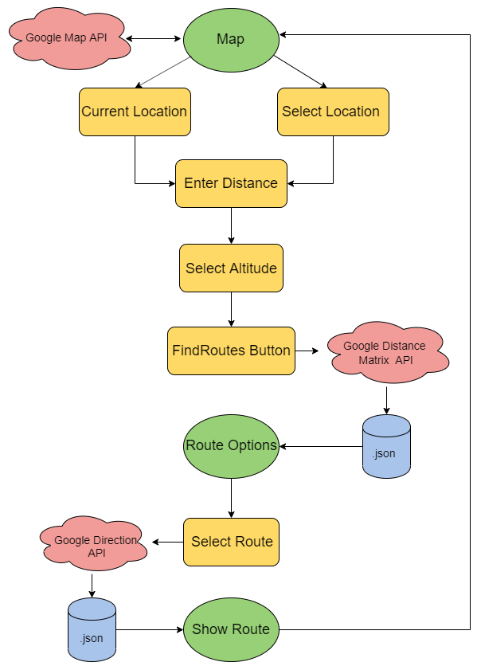

# EC601-Rout-Planner

## Product Definition
* Product Mission
  * We successfully built an Android app that can plan running routes with user-specified needs (distance) to improve running experience. The users can also save and delete the routes to their accounts for future access. 
* Target User(s)
  * Joggers and runners who is unfamiliar with the city 
  * Who wants to explore new running routes 
  * Who wants to plan a route with a specific distance
  
## System Design

## App Preview

## Configuration
* compileSdkVersion 28
* minSdkVersion 16
* targetSdkVersion 28
* com.google.firebase:firebase-analytics:17.2.1
* com.google.android.gms:play-services-drive:17.0.0

# Sprint 1

## Product Definition
* Product Mission
  * Build an Android app that can plan running routes with user-specified needs (including distance and altitude) to improve running experience. The users can also save and share the routes they’ve run with friends. 
* Target User(s)
  * Joggers and runners who is unfamiliar with the city 
  * Who wants to explore new running routes 
  * Who wants to plan a route with a specific distance
  * Who wants to plan a route with pre-defined uphills and downhills  
* User Stories
  * As a runner, I want to plan a running route with specific distance and altitude.
  * As a runner, I want to explore new running routes in the city. 
  * As a running enthusiast, I want to post my running route to a platform that can attract others to run my route. 
  * As a runner who is new to the city, I want to explore the beauty of the city by running along with the marvel landscapes and scenic places of this city.
* MVP
  * An app that is able to plan a running route with user-specified distance    
  * An app that is able to track the current location of the user 
* User Interface Design for main user story if required
  * An application

## Product Survey
* Existing similar products
  * plotarout.com 
  * mapometer.com
  * Just Draw It! Route planner & distance finder (App)
  * FindARun -Route Planner & Distance Finder (App)
* Patent Analysis
 
## System Design
* Major Components you think you will use
  * Google map api
  * Android studio
* Technology Selection and reasons behind selection including comparisons
* Any test or verification programs
  * Application demo 

## Administrative
* Project Lead
  * Sprint 1: Yumeng Pan
  * Sprint 2: Qianqian Guo
  * Sprint 3: Hancheng Zhang
* Meeting time
  * Monday, Wednesday class time 
  * Friday afternoon 4 - 6pm
  * Sunday afternoon 4 - 6pm
* Sprint 2 Plan and Assignment 

# Sprint 2

## APIs Considered
* Strava API
* Map My Run API
* Google map/directon/distance matrix API

## System Architecture

## Next Steps
* More route options
* Implement altitude selection feature
* Add way points
